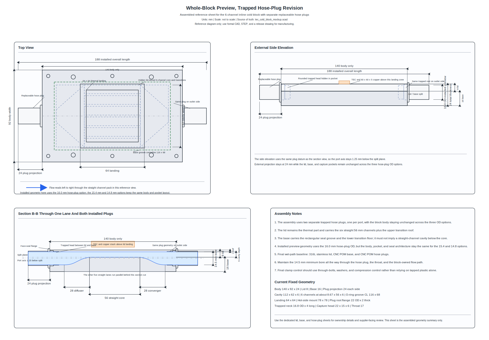
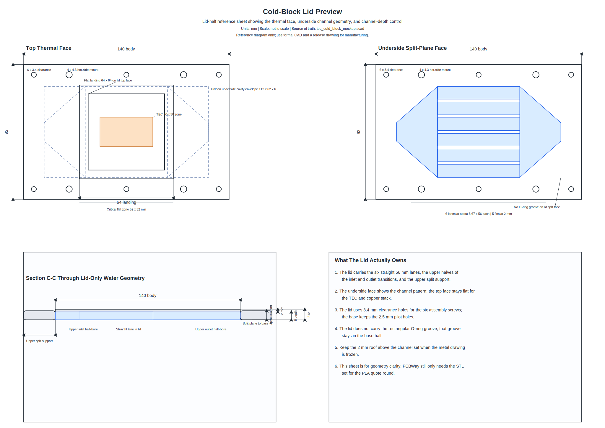
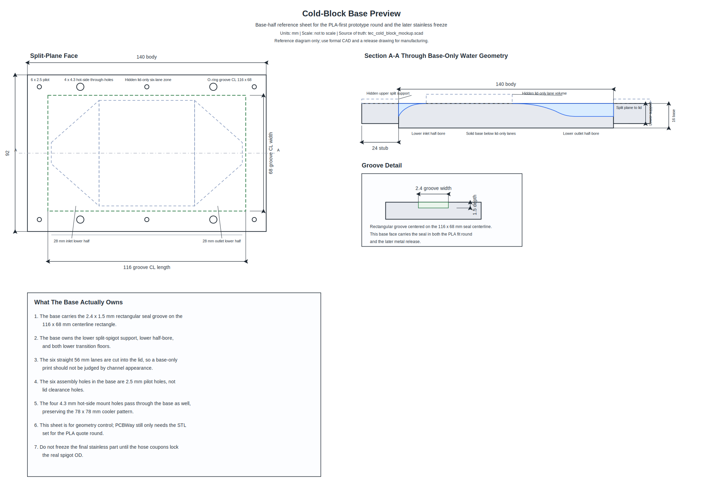
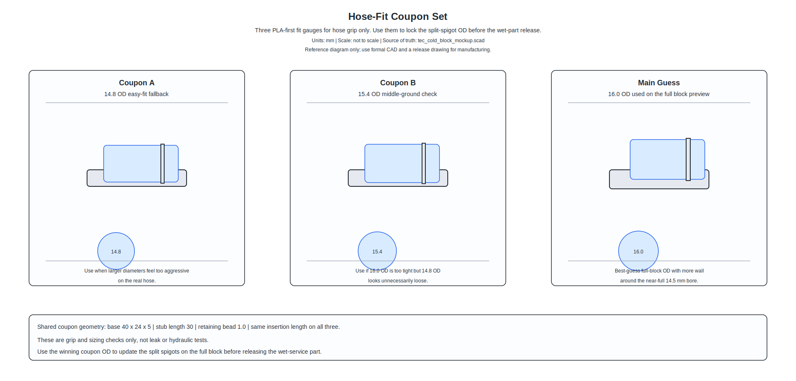
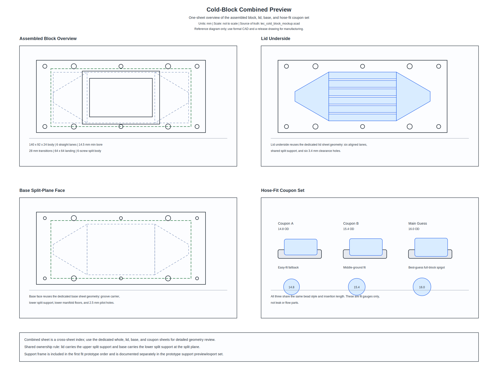
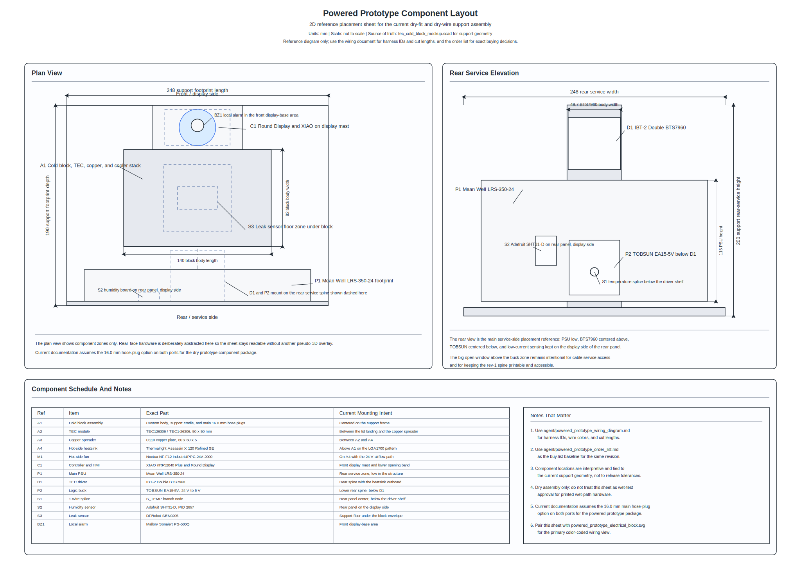
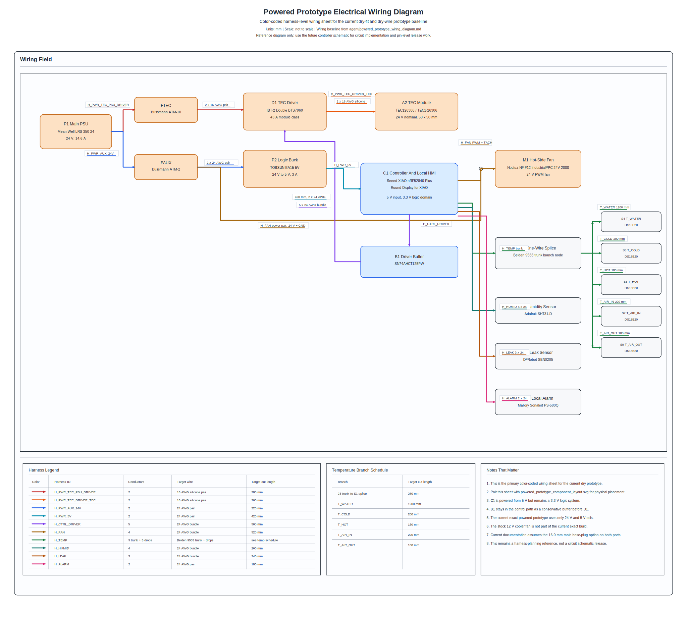

# Aquarium TEC Cold Block Prototype

This repository contains the current engineering baseline for a custom inline TEC chiller for an 8 gallon aquarium. The project is built around a low-restriction cold block, a staged prototype-to-CNC manufacturing path, and a first powered prototype that keeps the controller, HMI, and high-current TEC hardware explicit and orderable.

## What This Repo Holds

- A parametric OpenSCAD model for the cold block, hose-plug options, and interlocking powered-prototype support kit.
- Reference SVG sheets for the mechanical design and the powered-prototype electrical package.
- BOM, RFQ, validation, and controller-planning documents under `agent/` and `rfq/`.
- Quote-ready notes for both the PLA fit prototype and the final hybrid CNC wet-part set.

## Current Baseline

Mechanical baseline:

- Inline cold block body: 140 x 92 x 24 mm, excluding hose plugs.
- Internal water path: 6 straight channels with a 14.5 mm minimum bore through the full path.
- Lid/base split: 8 mm lid, 16 mm base.
- Thermal stack: 50 x 50 mm TEC, 60 x 60 x 5 mm copper spreader, Intel LGA1700 / LGA1851 hot-side mount.
- Hose-plug baseline: separate trapped plugs, with the current documentation assuming the 16.0 mm OD option on both ports.
- Final wet-part direction: 316L stainless lid, CNC POM base, and CNC POM hose plugs.

Powered prototype baseline:

- Main PSU: Mean Well LRS-350-24.
- TEC driver: IBT-2 Double BTS7960 43 A module.
- Logic buck: TOBSUN EA15-5V, 24 V to 5 V, 3 A.
- Controller: Seeed Studio XIAO nRF52840 Plus.
- Local HMI: Seeed Studio Round Display for XIAO.
- Hot-side cooler: Thermalright Assassin X 120 Refined SE.
- Hot-side fan: Noctua NF-F12 industrialPPC-24V-2000 IP67 PWM.
- Sensors: DS18B20 set, Adafruit SHT31-D, DFRobot SEN0205, and Mallory PS-580Q local alarm.

Prototype rules that remain important:

- The printed wet-path parts are for fit and dry assembly only.
- The 24 V and 5 V rails are the only rails in the current exact powered-prototype package.
- The final hose-plug OD is still gated on physical hose-fit testing.

## Key Docs

- [tec_cold_block_mockup.scad](tec_cold_block_mockup.scad): source-of-truth OpenSCAD model.
- [fabrication_notes.md](fabrication_notes.md): high-level geometry, usage, and file notes.
- [agent/mechanical_design.md](agent/mechanical_design.md): frozen geometry, support-frame intent, and manufacturing notes.
- [agent/system_bom.md](agent/system_bom.md): working BOM.
- [agent/powered_prototype_order_list.md](agent/powered_prototype_order_list.md): current buy-list freeze for the powered prototype.
- [agent/powered_prototype_wiring_diagram.md](agent/powered_prototype_wiring_diagram.md): harness IDs, cut lengths, and wiring topology.
- [agent/validation_and_open_items.md](agent/validation_and_open_items.md): validation gates and still-open items.
- [rfq/pla_prototype/pla_prototype_rfq_package.md](rfq/pla_prototype/pla_prototype_rfq_package.md): PLA prototype package.
- [rfq/final_hybrid_cnc/final_hybrid_cnc_rfq_package.md](rfq/final_hybrid_cnc/final_hybrid_cnc_rfq_package.md): final hybrid CNC package.

## SVG Gallery

### Whole Block Reference

Shows the assembled cold block reference view.

### Lid Reference

Shows the lid-owned geometry, channel pack, and thermal face role.

### Base Reference

Shows the base-owned geometry, seal groove, and lower water-path role.

### Hose-Plug Options

Shows the current 16.0 mm, 15.4 mm, and 14.8 mm hose-plug options.

### Combined Cold Block Overview

Shows the block, lid, base, and hose-plug option set in one reference sheet.

### Powered Prototype Component Layout

Shows the 2D component placement baseline for the powered prototype support assembly.

### Powered Prototype Electrical Block Sheet

Shows the detailed color-coded wiring diagram for the same powered prototype baseline.

## Manufacturing Path

Stage 1, PLA fit prototype:

- Validate hose fit, assembly access, clamp access, support-frame part fit, and service clearance.
- Do not use the printed cold block as the final wet-path part.

Stage 2, final hybrid CNC wet parts:

- Machine the lid from 316L stainless steel.
- Machine the base and hose plugs from POM.
- Keep the full-bore path and smooth diffuser/converger surfaces.
- Hold final wet-part release until hose-plug fit is locked from the real hose.

## Export And Verification

Available VS Code tasks include:

- `Export OpenSCAD Prototype STL Set`
- `Verify OpenSCAD Prototype STL Layouts`
- `Export OpenSCAD Prototype Support Service STL Set`
- `Export OpenSCAD Hybrid STL Set`
- `Export OpenSCAD Hybrid STEP Set`

Useful output folders:

- [rfq/pla_prototype/stl](rfq/pla_prototype/stl)
- [rfq/pla_prototype/exports](rfq/pla_prototype/exports)
- [rfq/final_hybrid_cnc/stl](rfq/final_hybrid_cnc/stl)
- [rfq/final_hybrid_cnc/step](rfq/final_hybrid_cnc/step)

## Open Gates

- Final hose-plug OD still depends on real hose-fit results.
- Final clamp size still depends on the chosen hose-plug OD and real hose measurements.
- Final wet-part seal cut length still depends on the released groove measurement.
- The controller PCB is still a planned deliverable, not a finished schematic/layout release.
- Leak-threshold calibration still remains a firmware and bring-up task.

## Practical Reading Order

1. Start with [fabrication_notes.md](fabrication_notes.md) for the repo overview.
2. Read [agent/mechanical_design.md](agent/mechanical_design.md) for the frozen geometry and support-frame intent.
3. Read [agent/system_bom.md](agent/system_bom.md) and [agent/powered_prototype_order_list.md](agent/powered_prototype_order_list.md) for the current hardware baseline.
4. Read [agent/powered_prototype_wiring_diagram.md](agent/powered_prototype_wiring_diagram.md) together with the two powered-prototype SVG sheets.
5. Use the RFQ packages when preparing quotes or exports.
