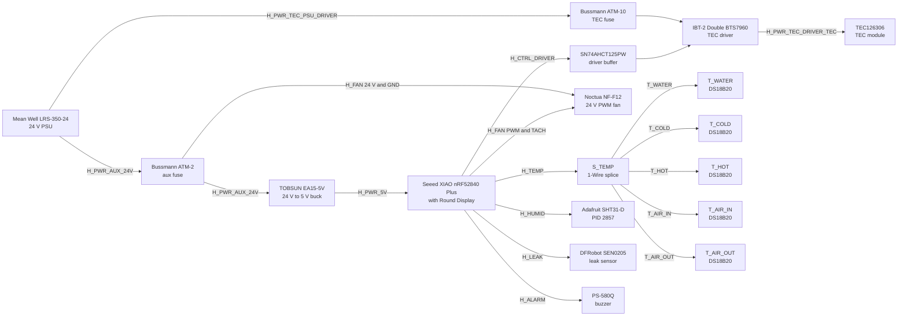

# Powered Prototype Wiring Diagram

This file is the wiring reference for the current dry-fit and dry-wire powered prototype.

Use `powered_prototype_electrical_block.svg` as the primary color-coded wiring sheet and `powered_prototype_component_layout.svg` as the companion 2D placement sheet.

## Build assumptions

- use the main 16.0 mm hose-plug option on both ports for the current component sheet and dry prototype
- use the printed prototype only for full assembly, cable routing, clamp access, and dry leak-sensor placement; do not run water through the printed wet-path parts
- include the leak sensor in the current harness and mount it under the block area for cabinet-floor drip detection
- use the TOBSUN EA15-5V buck below the BTS7960 on the support spine

## Harness legend

| Harness ID           | Color in wiring diagram |           Conductors | Target wire                          | Source                                    | Destination                |              Target cut length |
| -------------------- | ----------------------- | -------------------: | ------------------------------------ | ----------------------------------------- | -------------------------- | -----------------------------: |
| H_PWR_TEC_PSU_DRIVER | Red                     |                    2 | 16 AWG silicone pair                 | PSU 24 V output                           | IBT-2 power input          |                         280 mm |
| H_PWR_TEC_DRIVER_TEC | Orange                  |                    2 | 16 AWG silicone pair                 | IBT-2 motor output                        | TEC module                 |                         260 mm |
| H_PWR_AUX_24V        | Blue                    |                    2 | 24 AWG pair                          | PSU auxiliary branch after ATM-2 fuse     | TOBSUN EA15-5V input       |                         220 mm |
| H_PWR_5V             | Cyan                    |                    2 | 24 AWG pair                          | TOBSUN EA15-5V output                     | XIAO VBUS and logic branch |                         420 mm |
| H_CTRL_DRIVER        | Purple                  |                    5 | 24 AWG bundle                        | XIAO and SN74AHCT125PW                    | IBT-2 control header       |                         360 mm |
| H_FAN                | Yellow                  |                    4 | 24 AWG bundle                        | PSU auxiliary 24 V plus XIAO PWM and tach | Noctua NF-F12 24 V PWM fan |                         320 mm |
| H_TEMP               | Green                   | 3 trunk plus 5 drops | Belden 9533 trunk plus DS18B20 drops | XIAO 1-Wire bus                           | all five DS18B20 probes    | see temperature schedule below |
| H_HUMID              | Teal                    |                    4 | 24 AWG bundle                        | XIAO I2C branch                           | Adafruit SHT31-D breakout  |                         260 mm |
| H_LEAK               | Amber                   |                    3 | 24 AWG bundle                        | XIAO leak-input branch                    | DFRobot SEN0205            |                         240 mm |
| H_ALARM              | Magenta                 |                    2 | 24 AWG pair                          | XIAO alarm output                         | Mallory Sonalert PS-580Q   |                         180 mm |

Temperature schedule for H_TEMP:

| Branch                    | Target cut length |
| ------------------------- | ----------------: |
| J3 trunk to S_TEMP splice |            280 mm |
| T_WATER                   |           1200 mm |
| T_COLD                    |            200 mm |
| T_HOT                     |            180 mm |
| T_AIR_IN                  |            220 mm |
| T_AIR_OUT                 |            100 mm |

## Wiring topology

## Mounting intent for the dry prototype

| Part                   | Current mounting intent                                                                            |
| ---------------------- | -------------------------------------------------------------------------------------------------- |
| TOBSUN EA15-5V         | lower support spine, below the BTS7960, strap-mounted to the rear face                             |
| IBT-2 BTS7960          | rear face of the support spine with the heatsink outboard                                          |
| XIAO and Round Display | display-side mast and lower opening band                                                           |
| S_TEMP splice          | inside face of the rear panel, centered laterally and below the driver shelf                       |
| Adafruit SHT31-D       | inside face of the rear panel on the display side, above block height and out of the exhaust plume |
| DFRobot SEN0205        | on the support floor under the block envelope for drip-detection routing and dry assembly checks   |
| PS-580Q buzzer         | front display-base area for audible bench alerts                                                   |

## Notes that matter

1. The dry-build wiring package intentionally includes the leak sensor now so routing, connector access, and floor clearance can be checked before any wet testing.
2. The current wiring document is for physical harness planning and coordination with the 2D powered-prototype reference sheets; the SVG is the visual wiring sheet, but neither file replaces the future controller schematic.
3. If hose-fit testing later changes the final hose-plug OD, update the manuals and RFQ notes, not the current dry prototype wiring layout.
